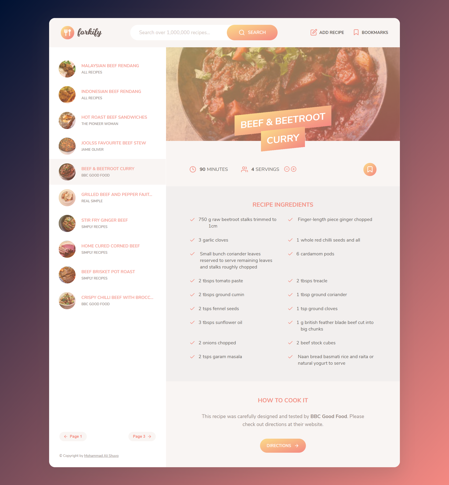
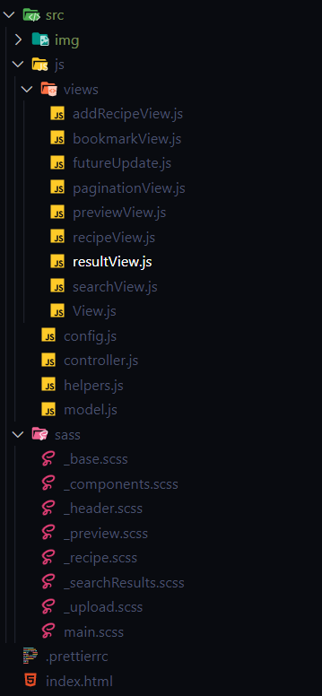

# A Recipe-Searching-Application
> by [Mohammad Ali Shuvo](https://github.com/shuvo18103107)
## Deployment
Deployed Website: https://forkify-shuvo.netlify.app/
# 

## Introduction

It is a recipe Searching web app using the Forkify API to allow users to search, view, modify, bookmark and add recipes.

### Technologies

HTML - SCSS - JS - Netlify 

### Libraries

Parcel, Sass

```sh
   npm i -D parcel@next sass
```

### Features

* Query an ingredient to recieve a list of recipes containing that ingredient.
* Easily bookmark or edit the servings of the selected recipe.
* Create your own recipes and store them as user recipes.
* Remove bookmarks or delete user recipes.
* LocalStorage keeps the data when users exit the app and many more.

### Project Architecture

# 

Built using the MVC Architecture. View class extends the rest of the components. Controller keeps bidirectional dataflow. SCSS files are divided for major components.

### API

The app is using the Forkify recipe API in order to fetch recipe information.

an example API GET request looks like this:
```sh
{
    "status":"success",
    "data":{
        "recipe":{
            "publisher":"My Baking Addiction",
            "ingredients":[
                {
                "quantity":1,
                "unit":"",
                "description":"tbsp. canola or olive oil"
                },
                {
                "quantity":0.5,
                "unit":"cup",
                "description":"chopped sweet onion"
                },
                {
                "quantity":3,
                "unit":"cups",
                "description":"diced fresh red yellow and green bell peppers"
                },
                {
                "quantity":1,
                "unit":"",
                "description":"tube refrigerated pizza dough"
                },
                {
                "quantity":0.5,
                "unit":"cup",
                "description":"salsa"
                },
                {
                "quantity":2,
                "unit":"cups",
                "description":"sargento chefstyle shredded pepper jack cheese"
                },
                {
                "quantity":null,
                "unit":"",
                "description":"Chopped cilantro or dried oregano"
                }
            ],
            "source_url":"http://www.mybakingaddiction.com/spicy-chicken-and-pepper-jack-pizza-recipe/",
            "image_url":"http://forkify-api.herokuapp.com/images/FlatBread21of1a180.jpg",
            "title":"Spicy Chicken and Pepper Jack Pizza",
            "servings":4,
            "cooking_time":45,
            "id":"5ed6604591c37cdc054bc886"
        }
    }
}
```
## Furure Improvment 
- Display number of pages between the pagination button.
- ability to sort search results by duration or number of ingredients.
- perform ingredient validation in view , before submitting the form.
- improve recipe ingredient input: sepearate in multiple fields and allow more than 6 ingredients.
- shopping list feature: button on recipe to add ingredients to a list.
- weekly meal planning feature : assign recipe to the next 7 days and show on a weekly calender, can create a dropdown on each recipe then show it for the next 7 days.
- get nutrition data on each ingredients from spoonacular API(https://spoonacular.com/food-api) and calculated total calories of recipe.

## Thank you!

Thank you so much for checking out this project! If you have any notes or bugs send them my way and I'll make sure they're fixed.
